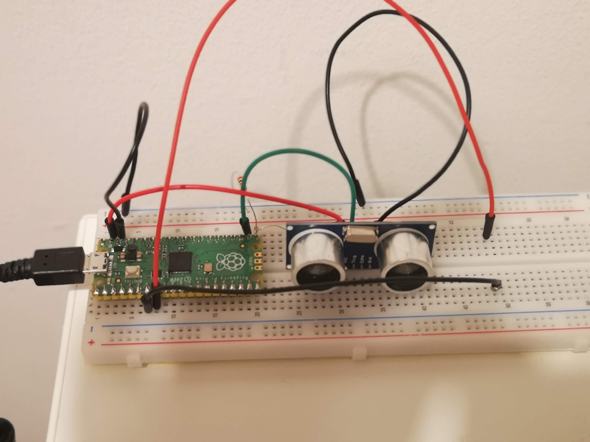

# HC-SR04

The HC-SR04 is an Ultrasonic Ranging Module - cick [here](https://cdn.sparkfun.com/datasheets/Sensors/Proximity/HCSR04.pdf) for a data sheet.

Code sample is taken from [here](https://www.freva.com/hc-sr04-ultrasonic-distance-sensor-with-raspberry-pi-pico/).

