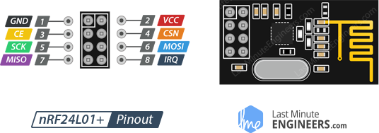

# NRF24L01 Transceiver

Two PICOs using a NRF24L01 transceiver

 

| Pin | Number	| Description |
| --- | ---	| --- |
| GND  |  1	|	  | 				
| VCC  |  2	|	3V  |
| CE	| 3	|	  |
| CSN	| 4	|	  |
| SCK	| 5	|	  |
| MOSI	| 6	|	  |
| MISO	| 7	|	  |
| IRQ	| 8	|	  |