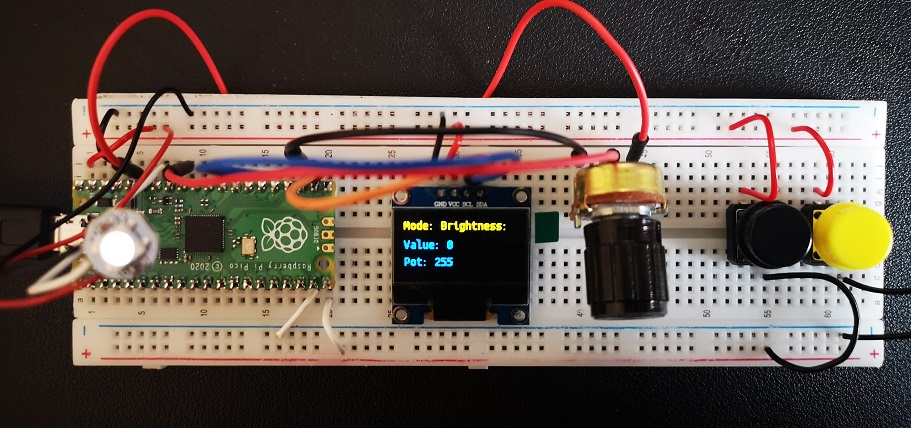

# SSD1330 Project

This is a simple project which tests an OLED display with an SSD1330 driver. It contains:

 * An 128 x 64 pixel SSD1330 display
 * A 5K Potentiometer 
 * An SK6812 smart pixel
 * Two push buttons
 
 This project controls the RGB Brightness status of the smart pixel and displays those values.
 
 
 
 The potentionmeter is used to specify a value between 1 and 255, one button is used to select a mode (red, green, blue and brightness) and the other other button applies that value to the selected mode. The display shows the current values.
 
 ## Wiring
 
 Neopixel din = P28
 Mode select button = P15
 Colour set = P14
 Potentiometer = P27
 Display = SCL:P17, SDA:16
 