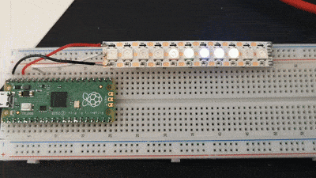

# Strobing

A simple piece of code to show a block of 5 leds moving from left to right on an 11 LED strip of WS2812B running off VBUS and GND for power and GP28 for data.

And yes I know the colours for the wires for VBUS and GND are the wrong way round - it was late and I was tired.

Running the code and deploying it will produce the following:

